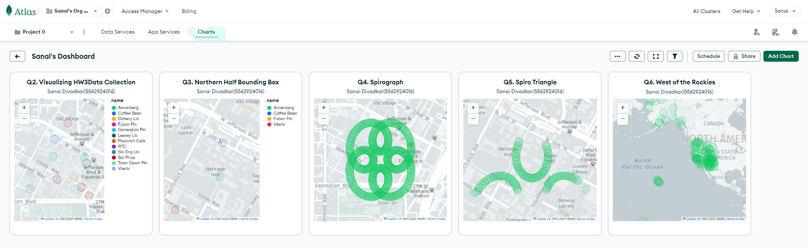

# Introduction
Led advanced geo-spatial analyses on 13 USC sites and created a complex Spirograph™ curve around Tommy Trojan using PostGIS, OpenLayers, and ArcGIS Online. Demonstrating expertise in GIS and precise spatial quantification. 

# Dashboard

## Project Index

### Queries
1. [Queries.txt](./Postgres_Queries/Queries.txt)
2. [Queries.sql](./Postgres_Queries/Queries.sql)

### Screenshots
1. [Q3](./Screenshots/Q3.png)
2. [Q5a_ConvexHull](./Screenshots/Q5a_ConvexHull.png)
3. [Q5b_Nearest_Neighbor](./Screenshots/Q5b_Nearest_Neighbor.png)
4. [Q6](./Screenshots/Q6.png)

### Selfies
1. Location1- Annenberg
2. Location2- Coffee Bean
3. Location3- Doheny Library
4. Location4- Fubon Fountain
5. Location5- Generation Fountain
6. Location6- Home
7. Location7- Leavey Library
8. Location8- Popovich Cafe
9. Location9- RTC
10. Location10- Sci Eng Library
11. Location11- Sol Price
12. Location12- Town and Gown Fountain
13. Location13- Viterbi

### SpiroPlot
1. [ArcGIS Screenshot](SpiroPlot/ArcGIS.png)
2. [Shapefile Zip](SpiroPlot/shapefile.zip)
3. [Spiro.kml](SpiroPlot/Spiro.kml)
4. [SpiroPlot.py](SpiroPlot/SpiroPlot.PNG)

### HTML
- [OL.html](OL.html)

## Contributing

Contributions to Othello Odyssey are welcome! If you'd like to contribute to the project, feel free to fork the repository, make your changes, and submit a pull request. Bug reports, feature requests, and feedback are also appreciated and can be submitted via the [issue tracker](https://github.com/shecoderfinally/Othello-Odyssey/issues).

## License

This project is licensed under the MIT License - see the [LICENSE](https://github.com/shecoderfinally/Othello-Odyssey/blob/main/LICENSE) file for details.

#### Additional Resources
- [Jsfiddle Link](https://jsfiddle.net/SanaiDivadkar/5f42wy31/7/)
